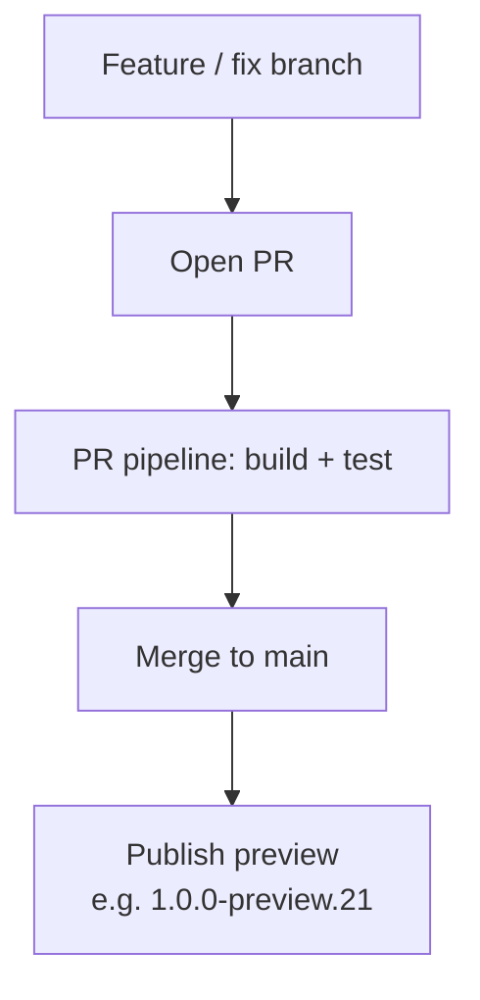
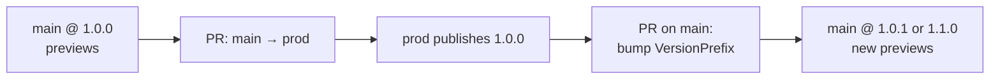
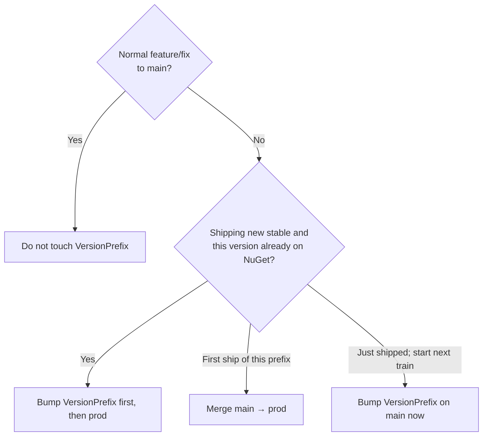
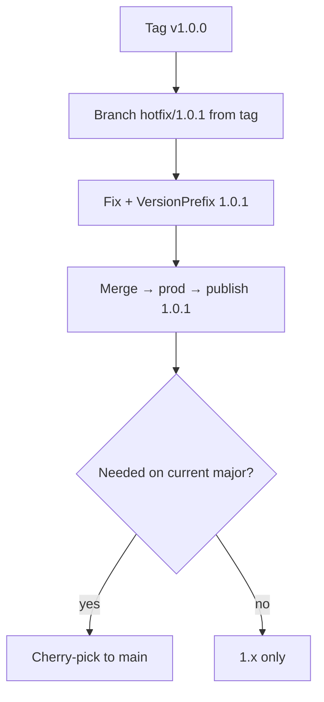
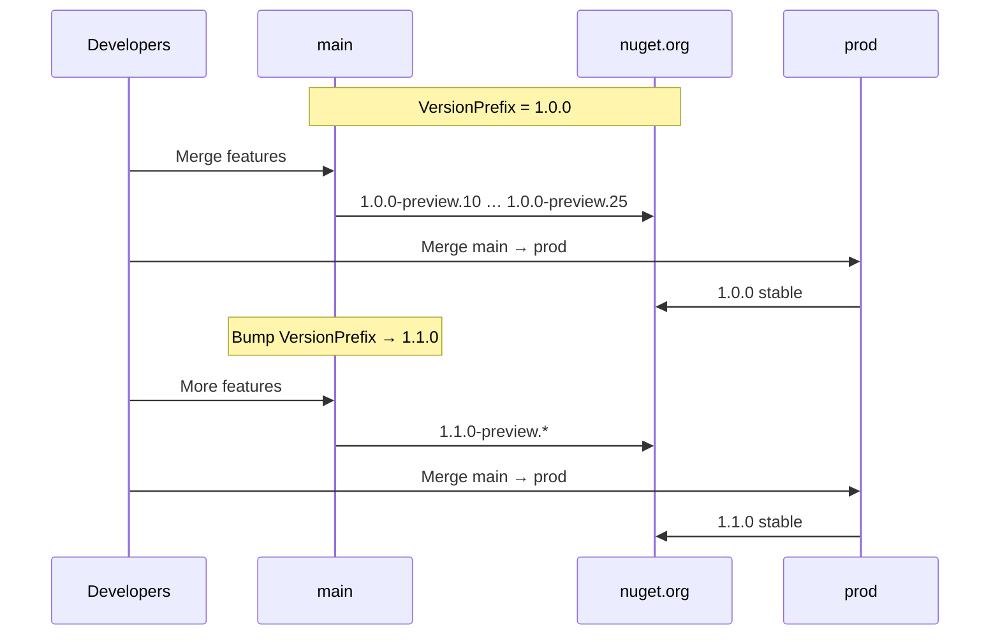

# Versioning and release process

This document describes how DataQL versions are chosen, published, and hotfixed.

## Summary

| Branch / line | NuGet version | When |
|---------------|---------------|------|
| `main` | `{VersionPrefix}-preview.{N}` | Every merge to `main` |
| `prod` | `{VersionPrefix}` | Promote current train to stable |
| `maintenance/{major}.x` | Patch on that major (e.g. `1.0.1`) | Hotfix older supported majors |

`VersionPrefix` lives in [`Directory.Build.props`](../Directory.Build.props).  
`N` is the GitHub Actions `run_number` for the preview publish workflow.

**Do not bump `VersionPrefix` on every feature merge to `main`.** The preview counter already makes each publish unique.

---

## What a preview version means

`1.0.0-preview.12` is a **prerelease of `1.0.0`**, not of `1.0.1`.

SemVer / NuGet order:

```text
1.0.0-preview.1  <  1.0.0-preview.99  <  1.0.0  <  1.0.1-preview.1  <  1.0.1
```

So:

- While building toward the first `1.0.0` stable → keep `VersionPrefix = 1.0.0` → publish `1.0.0-preview.N`
- After `1.0.0` is released → bump `VersionPrefix` on `main` to `1.0.1` / `1.1.0` / `2.0.0` so new previews are betas of the **next** release

Open feature PRs usually do **not** embed a package version. After you bump `VersionPrefix` on `main`, merges inherit the new train automatically (unless the PR also edited `Directory.Build.props`).

---

## Branches

```text
feature/*          → PR → main
main               → current major development + preview publishes
prod               → current major stable publishes
maintenance/1.x    → older supported major (hotfixes only)
maintenance/2.x    → created later when 3.x is current (if still supporting 2.x)
```

Protect `main` and `prod` on GitHub (PR required, no direct push, no force push).

---

## Day-to-day development



1. Open a PR (any target branch runs the **PR** workflow).
2. Merge to `main` when approved.
3. **Publish preview** runs: packs and pushes `{VersionPrefix}-preview.{N}`, tags `v{VersionPrefix}-preview.{N}`.
4. **Do not** change `VersionPrefix` for normal features/fixes.

Multiple developers do not conflict on preview numbers: CI assigns `N` when the merge is published. They only conflict if several PRs change `VersionPrefix` at once — avoid that; use a dedicated bump PR.

---

## Shipping a stable release (current major)

`VersionPrefix` on `main` should already be the version you intend to ship (e.g. `1.0.0`).



### Steps

1. Ensure `main` is healthy (tests green; enough `1.0.0-preview.*` soak if you want).
2. Open PR **`main` → `prod`** (required reviewers on `nuget-prod` recommended).
3. Merge → **Publish stable** pushes exactly `VersionPrefix` (e.g. `1.0.0`) and tags `v1.0.0`.
4. **Immediately** open a PR on `main` that bumps `VersionPrefix` to the next train (`1.0.1`, `1.1.0`, or `2.0.0`).
5. Continue feature work on `main` → new previews are betas of that next release.

### Important

- **Do not** bump to `1.0.1` *before* merging to `prod` if you still intend to ship `1.0.0`.
- If `1.0.0` is already on nuget.org and you merge to `prod` again without bumping, push uses `--skip-duplicate` and **no new package** is published even though git moved.

---

## Decision cheat sheet



---

## Hotfixes for an older major

After you have moved on (e.g. `main` / `prod` are on `2.x`), a vulnerability on `1.0.0` is fixed on a **maintenance line**, not by republishing under `2.x` only.

### Policy

- Keep one long-lived branch per **supported** older major: `maintenance/1.x`, `maintenance/2.x`, …
- Create it from that major’s stable tag when you leave the major (e.g. from `v1.0.0` when `2.0.0` ships), or at first need.
- Drop the branch when you stop supporting that major.

### Flow (prod still on that major)



### Flow (prod already on a newer major)

Do **not** merge the `1.0.1` hotfix into current `prod` (that would mix majors).

1. Branch from `v1.0.0` (or update `maintenance/1.x`).
2. Fix + set `VersionPrefix` to `1.0.1`.
3. Publish `1.0.1` from that line (tag `v1.0.1`; use a maintenance publish path or manual Trusted Publishing publish until automated).
4. Cherry-pick the fix onto `main` if `2.x` needs it — **keep `main`’s `VersionPrefix`** (e.g. stay on `2.0.0`).

### Versioning on two lines

```text
hotfix line     → VersionPrefix 1.0.1 → NuGet 1.0.1
cherry-pick main → keep 2.0.0 train   → next 2.0.0-preview.N includes the fix
```

---

## Timeline example



---

## Publishing setup (Trusted Publishing)

Publishing uses [NuGet Trusted Publishing](https://learn.microsoft.com/en-us/nuget/nuget-org/trusted-publishing) (OIDC). No long-lived NuGet API key.

### Workflows

| Workflow | File | Trigger | Version |
|----------|------|---------|---------|
| PR | `.github/workflows/pr.yml` | Pull requests (any branch) | Build/test only |
| Publish preview | `.github/workflows/publish-preview.yml` | Push to `main` | `{VersionPrefix}-preview.{N}` |
| Publish stable | `.github/workflows/publish-stable.yml` | Push to `prod` | `{VersionPrefix}` |

Version resolution and branch enforcement: [`build/Resolve-PackageVersion.ps1`](../build/Resolve-PackageVersion.ps1).

### One-time nuget.org / GitHub setup

1. **Trusted Publishing** policies:

   | Policy | Workflow file | Environment |
   |--------|---------------|-------------|
   | Preview | `publish-preview.yml` | `nuget-preview` |
   | Stable | `publish-stable.yml` | `nuget-prod` |

2. Repo secret `NUGET_USER` = nuget.org **username** (not email).
3. GitHub Environments:
   - `nuget-preview` — deployment branch: `main` only
   - `nuget-prod` — deployment branch: `prod` only; required reviewers recommended
4. Create `prod` when ready for the first stable: from `main`, push `prod`.

### Local version check

```powershell
./build/Resolve-PackageVersion.ps1 -Kind preview -PreviewNumber 1
./build/Resolve-PackageVersion.ps1 -Kind stable
```

---

## Packages published

| Package | Project |
|---------|---------|
| `DataQL` | `DataQL` |
| `DataQL.AspNetCore` | `DataQL.AspNetCore` |
| `DataQL.Sqlite` | `DataQL.Sqlite` |
| `DataQL.SqlServer` | `DataQL.SqlServer` |
| `DataQL.Cosmos` | `DataQL.Cosmos` |

Test projects and `DataQL.ExampleApi` are not packable (`IsPackable=false` via `Directory.Build.props`).

---

## Quick reference

| Situation | Action |
|-----------|--------|
| Feature → `main` | No version bump; preview auto-publishes |
| First stable of current prefix | PR `main` → `prod` |
| After stable ships | Bump `VersionPrefix` on `main` |
| Next stable already published under that number | Bump first, then `prod` |
| Security fix on old major | `maintenance/{major}.x` or branch from tag; patch version; cherry-pick to `main` if needed |
| Every major you still support | Keep a `maintenance/{major}.x` branch to release from |
